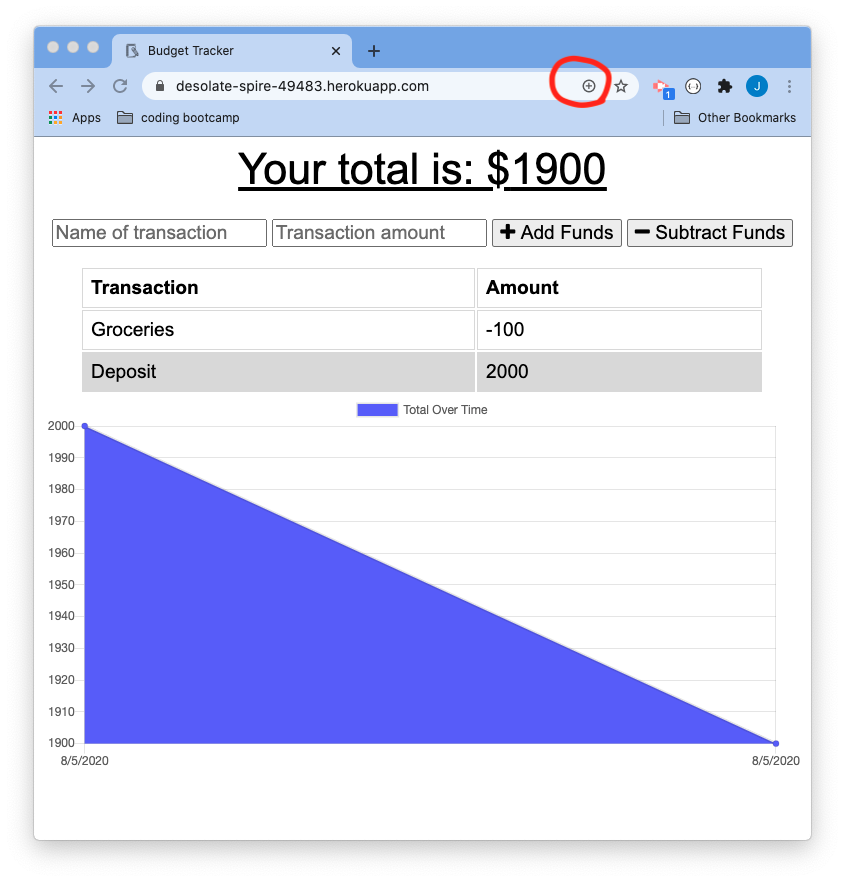
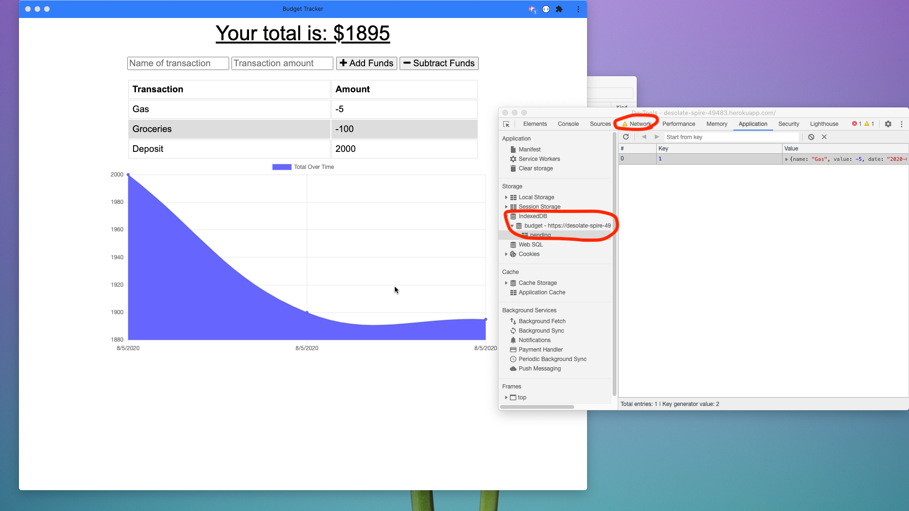
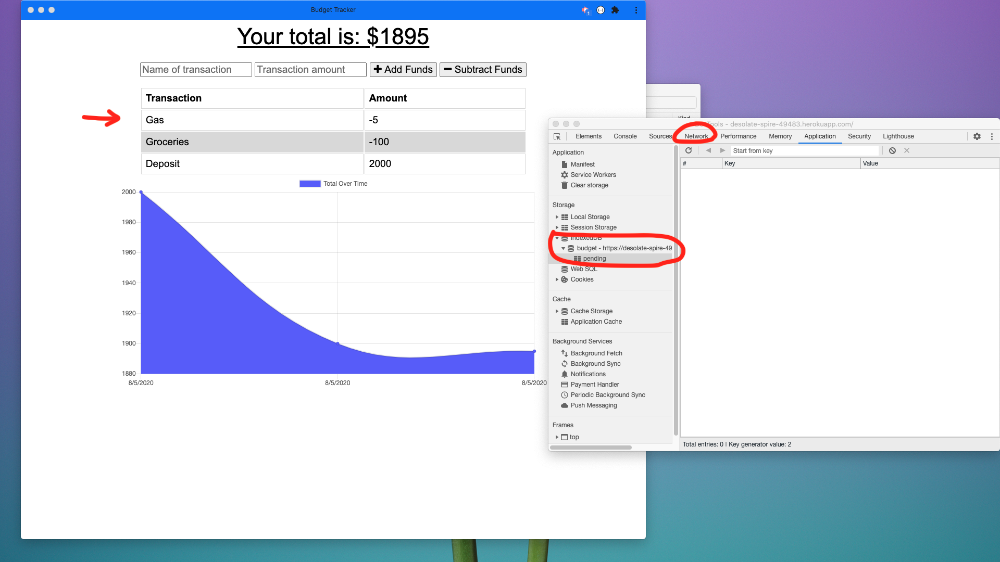

# Budget-Tracker

## Table of Contents

* [Description](#description)
* [Installation](#installation)
* [Deployed Application](#application)
* [Screenshots](#screenshots)

## Description 

This is a budget tracker app. This app allows the user to maintain their financial statment by entering expenses and deposits both online and offline. This progressive web application (PWA) uses MVC architecture and follows REST protocol. MongoDB is used for presisting data. Mongoose is used as ODM to create models. Node's express is used for routing. HTML is used for UI,  CSS is used for styling and java script is use to implement event listering and making ajax calls to server. Manifest, service workers and chaching mechanism is implemented to make this app PWA. IndexedDB is used to persist data during offline.

Git is used for version controlling and for periodic commits to Gitlab.

## Installation

Execute ``` npm install ``` command in terminal(Mac) or command promt(windows) to install all needed packages to run this application successfully.

Run ``` npm run start ``` command in terminal(Mac) or command promt(windows) to start the application.


## Application

The application is deployed in heroku and can be found at https://desolate-spire-49483.herokuapp.com/


## Screenshots
 <br>
<br>
<br> 